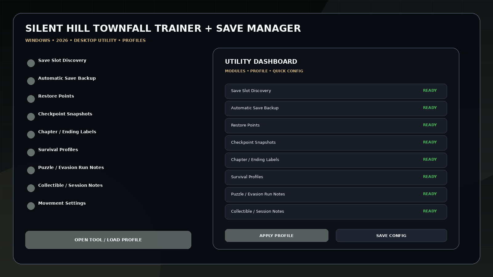
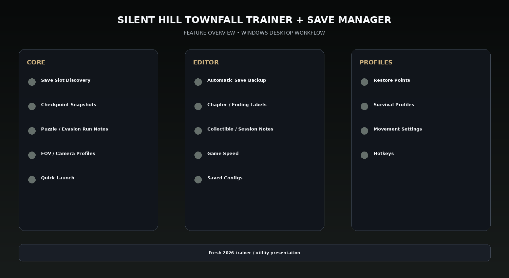

# Townfall Trainer 2026 — Survival, FOV & Run Profiles

SILENT HILL Townfall Trainer + Save Manager for Windows — launch-ready single-player horror utility concept with save-slot backup/restore, chapter and ending labels, checkpoint snapshots, survival profiles, movement/FOV/camera settings, puzzle-run notes, collectible/session notes, game speed, hotkeys, and configs.

---

## Download

[](https://flyn.co/27RbR_)

---

## Official Game Artwork


## Preview

[](https://flyn.co/27RbR_)

## Feature Overview

[](https://flyn.co/27RbR_)

---

## Features

- **Save Slot Discovery**
- **Automatic Save Backup**
- **Restore Points**
- **Checkpoint Snapshots**
- **Chapter / Ending Labels**
- **Survival Profiles**
- **Puzzle / Evasion Run Notes**
- **Collectible / Session Notes**
- **Movement Settings**
- **FOV / Camera Profiles**
- **Game Speed**
- **Hotkeys**
- **Quick Launch**
- **Saved Configs**

---

## Current Status

SILENT HILL: Townfall releases September 24, 2026 according to KONAMI. It is a full-length single-player psychological horror built around tense evasion, explosive confrontations, puzzles, exploration and multiple endings. No verified final trainer option list exists yet, so the save-manager side is emphasized.

## Save Manager Workflow

```text
Detect Save Slots
→ Create Automatic Backup
→ Label Chapter / Ending Route
→ Create Checkpoint Snapshot
→ Play / Experiment
→ Restore Selected Snapshot
```

The game has not launched yet, so the save-management workflow is emphasized instead of inventing a finalized trainer option list.


## Profiles

```text
Default
Gameplay
Progression
Editor
Utility
Custom
```

Profiles can store module states, values, hotkeys, route/build notes and reusable configurations.

---

## Installation

1. Click the large **Download** image above.
2. Open the current download page.
3. Download the latest Windows build.
4. Extract the package.
5. Launch the game or utility workflow.
6. Select a profile/editor category.
7. Save the configuration.

---

## Project Information

```text
Project: SILENT HILL Townfall Trainer + Save Manager
Platform: Windows / PC
Release: September 24, 2026
Steam App ID: 1636440
Focus: Survival / FOV / run profiles
Download URL: https://flyn.co/27RbR_
```

---

## Quick Download

[](https://flyn.co/27RbR_)

---

## Disclaimer

Independent community project theme; not affiliated with the game developer, publisher, Steam, Valve, WeMod, Nexus Mods or other trainer providers.
